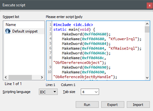

# Black Energy Driver
---
Documenting my research of Black Energy Driver, which is the loaded driver in the memory sample from "Malware Analyst Cookbook".  
I was focusing integrating disassembling and Windows internals skill with memory forensics skills.

### Background 
---
Black Energy is a malware used to perform variety of attacks. It contains multiple plugins used to perform different attacks capabilities. 
I used Volatility to preform all the analysis of the memory sample and I have find out that there is loaded driver used by the malware.  
I was interesting about the key features of the Black Energy Driver and wanted to understand how can I perform static reverse engineering of the driver when I have only the memory dump.  
I couldn't find any report or documentation about loaded driver so I decided to try by myself 😄

### Memory forensics
I will skip this part because this is the well documented part. You can find lot of information and examples of investigating the Black Energy Driver using Volatility plugins. 
I will go back to specific Volatility-plugins to fill the gap when I will dump the Black Energy Driver and start disassembling it.

### Callbacks 
* After running `callbacks` plugin on the memory sample we can see strange module-name appear: `00004A2A`. 

* The callbacks used by this module are: `PsCreateThreadNotifyRoutine` which can be used track and to notify the Driver whenever new Thread is created or terminated in the system.

### Dump the driver
* After finding indicator of suspicious module we can dump it and try finding it's logic using IDA.
* Let's find the base address of the module by it's name using `modscan` plugins and `grep`: 

* We can use `moddump` to dump the module and perform further analysis using IDA: 

* After dumping the module we should rebasing the driver address layout as it was when it was running when the memory dump was taken.
* Now we can load the module into IDA and perform rebasing to whole the module: 

* Now we can start disassembling the module and search for more insights 💪✌️

### One more thing: IAT recovery 
* After fixing the address layout we can start reversing the module.
* The reversing process will be very difficult because IDA won't recognized any import functions used by the module, because the `IAT` is "broken"
* We can use a another Volatility plugin to  to recover the IAT using volatility `impscan` plugin: 

* The output is very useful for our mission:
  * IAT - represent address from the IAT directory of the module when is was running
  * Function - The name of the import-function used in this address.
* I was writing simple script using Python to convert the output of `impscan` to useful `IDC` script which we can use in IDA: 

* The script can be used as follow: `impscam_to_idc.py <iat_dump> <recovery_output>`
* Let's look at the output (`IDC` script): 

* Let's load the output script and fix the IAT of the module: 

* Now we can see the recovered IAT and we can continue examining the module: 

* Now IDA can provide us all the useful features, such as XRefs, etc.

### Using the recovered imports
* TODO

### Return to the callback routine
* TODO

### Dispatch routines
* TODO

### Custom import loading 
* TODO